# **Relazione Progetto ML**

```
Marcucci Michele  [851905]
Mazzitelli Davide [851657]
```

## **Obiettivo del progetto:**

L'obiettivo del progetto consiste nell'identificare un dominio di interesse per il quale realizzare almeno 2 modelli di classificazione supervisionata e/o non supervisionata, individuando il relativo dataset.

## **Dominio di riferimento:**

Il dominio di interesse selezionato per il nostro progetto riguarda il prezzo di vendita di laptop nuovi sulla base dei rispettivi componenti e brand di produzione.


# **Dataset**

## **Laptop Price**

Questo dataset raccoglie informazioni tecniche su diversi modelli e marche di laptop

1. **Company** - String - Laptop Manufacturer
2. **Product** - String - Brand and Model
3. **TypeName** - String - Type (Notebook, Ultrabook, Gaming, etc.)
4. **Inches** -Numeric - Screen Size
5. **ScreenResolution** - String - Screen Resolution
6. **Cpu** - String - Central Processing Unit (CPU)
7. **Ram** - String - Laptop RAM
8. **Memory** - String - Hard Disk / SSD Memory
9. **GPU** - String - Graphics Processing Units (GPU)
10. **OpSys** - String - Operating System
11. **Weight** - String - Laptop Weight
12. **Price_euros** - Numeric - Price (Euro)

### **Head**

|laptop_ID|Company|Product|TypeName|Inches|ScreenResolution|Cpu|Ram|Memory|Gpu|OpSys|Weight|Price_euros|
|---------|-------|-------|--------|------|----------------|---|---|------|---|-----|------|-----------|
1|Apple|MacBook Pro|Ultrabook|13.3|IPS Panel Retina Display 2560x1600|Intel Core i5 2.3GHz|8GB|128GB SSD|Intel Iris Plus Graphics 640|macOS|1.37kg|1339.69|
14|Dell|Inspiron 3567|Notebook|15.6|Full HD 1920x1080|Intel Core i3 6006U 2GHz|4GB|256GB SSD|AMD Radeon R5 M430|Windows 10|2.2kg|498.90


# **Preprocessing dei dati**

## **Assunzioni ed analisi esplorativa**

Abbiamo deciso di non ragionare sul prezzo numerico effettivo, quanto piu' sulla fascia di prezzo alla quale appartiene ogni laptop. A tal proposito abbiamo creato la colonna "ranges" costituita da quattro classi:

- **Fascia bassa**: < 500€
- **Fascia media**: 500-1000€
- **Fascia alta**: 1000-2000€
- **Fascia premium**: > 2000€


## **Memory (memoria dello storage interno)**

Questa colonna contiene valori in diverse unità di misura (GB, TB) e riferiti a diversi dipi di hardware (SSD, HDD, ecc...), alcuni laptop hanno inoltre due Hard Drive, che possono essere anche di diverso tipo e dimensione (es: "128GB SSD + 1TB HDD").

Per ogni laptop abbiamo quindi deciso di estrapolare da questa colonna delle informazioni che seguissero una logica piu' precisa, ovvero:

| HDD | SSD | Altri tipi |
|-----|-----|------------|
|N. GB|N. GB|N. GB|

In questo modo abbiamo ottenuto informazioni relative al tipo di memora utilizzato e alla quantità di GB per tipo.
(gli SSD sono piu costosi degli HDD quindi è un dato utile ai fini della realizzazione del modello)

## **Weight (peso del laptop) e RAM**
Queste colonne contengono valori char che per semplicità sono stati trasformati in valori numerici.

(8GB -> 8 e 1.5kg -> 1.5)

NB: I dati relativi al peso dei pc interessano una fetta molto piccola del database, infatti spesso un pc molto pesante (4kg) è un pc da gaming o una workstation (Fascia alta-premium).

La ram invece risulta essere un chiaro fattore che fa aumentare il prezzo in base alla quantità presente.


## **GPU (informazioni sulla scheda grafica)** 
Come per la colonna riguardante la memoria anche in questa sono presenti molte informazioni che necessitano una semplificazione.

Abbiamo inizialmente ragionato per quanto riguarda il produttore della scheda grafica: Intel e AMD sono schede grafiche quasi sempre integrate nei processori mentre NVIDIA realizza schede grafiche dedicate che fanno quindi alzare il prezzo.

La nostra idea era quindi:
- pc con scheda grafica Intel o AMD allora puo appartenere a qualunque fascia
- pc con scheda grafica NVIDIA allora appartiene quasi sicuramente alla fascia alta

Seguendo questa strada però non abbiamo tenuto conto che sia Intel, AMD che NVIDIA realizzano schede grafiche per diverse fasce di prezzo, abbiamo quindi cercato di estrapolare anche la "famiglia" di appartenza di ciascuna scheda grafica, ottenendo quindi piu diversificazione e piu classi (ma comunque un numero accettabile).

NB: Intel HD è la famiglia di schede grafiche integrata dai processori Intel, usata sia da pc low cost che da macbook e workstation.


## **CPU**

Analogamente, come per la GPU, anche questa colonna contiene informazioni ridondanti. 
Abbiamo quindi cercato di mantenere solo il produttore della CPU insieme alla famiglia di appartenenza, inoltre abbiamo unificato tutte quelle famiglie di processori prodotte per la fascia bassa (come Intel Atom/Celeron/Pentium AMD-A/E), ottenedo questi dati:


## **Schermo**

Anche in questa colonna le informazioni contenute erano molto diverse le une dalle altre e utilizzavano anche diversi paramentri e tipologie di misura.

Es: 
- IPS Panel Retina Display 2560x1600
- Full HD 1920x1080
- 1366x768

Abbiamo innanzitutto cercato di estrapolare la tipologia di display (HD, FHD, QHD, 4K ecc) basandoci sia sulla risoluzione fornita sia sulla presenza o meno di una stringa che ne indicasse la tipologia, indicando anche, in una diversa colonna, se lo schermo fosse o meno TouchScreen.


**Plot distribuzione touch screen**


Abbiamo creato anche una colonna che raccogliesse l'informazione del tipo di pannello (IPS, True o False) dato che la presenza di un pannello IPS solitamente indica una maggiore qualità e costo complessivi.


## **Sistema Operativo**

Anche per questa colonna abbiamo provveduto ad una semplificazione delle classi presenti dividendo i sistemi operativi in "Windows", "Mac" e "Linux/Other"


## Eliminazione colonne inutili e risultato finale

Il nuovo dataset ottenuto e composto dalle seguenti colonne:
- Company
- TypeName
- Inches
- ScreenResolution
- OpSys
- Weight
- HDD
- SSD            
- range
- RamGB
- Gpu_Vendor
- Cpu_model      
- isTouchScreen
- isIPS
---


# **Modelli di Machine Learning scelti:**
Una volta elaborato il dataset si è proceduto con la scelta dei modelli di classificazione da implementare.


## **Albero di decisione:**
Il primo modello selezionato è l'albero di decisione a causa della possibilità di gestire sia dati numerici che categorici (generati nella fase di preprocessing dei dati) e la facilità di interpretazione.

Il dataset è stato quindi diviso in training set e test set (70% training set, 30% test set), ottenendo 919 record per il train set e 384 per il test set.

Il modello è stato addestrato utilizzando la funzione rpart, ponendo come target l'attributo *range* in funzione di tutti gli attributi del set.

L'albero di decisione risultante è il seguente:


Dall'immagine possiamo notare tra gli attributi quelli con maggior information gain che permettono lo split ottimale del set.

Notiamo inoltre che l'albero minimo di decisione consistente utilizza 8 dei 12 attributi utilizzati per l'addestramento.

**Risultati ottenuti testando il modello con il test set:**
 

> 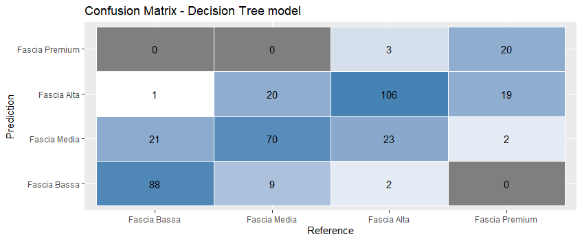
>
> **Accuratezza:** 74%
>
> **Precision:**
>
> - Fascia bassa: 89%
> - Fascia media: 60%
> - Fascia alta: 73%
> - Fascia premium: 87%
> 
>   **Precisione media:** 77% 
> 
> **Recall:**
>
> - Fascia bassa: 80%
> - Fascia media: 71%
> - Fascia alta: 79%
> - Fascia premium: 49%
>
>   **Recall media:** 70%
>
> **F-measure:**
> 
> - Fascia bassa: 84%
> - Fascia media: 65%
> - Fascia alta: 76%
> - Fascia premium: 62% 
>
>   **F-measure media:** 72%

---
## **SVM:**

Per le sue caratteristiche di efficienza nell'apprendimento, buone prestazioni e flessibilità come secondo modello è stato selezionato l'SVM 

Il modello è stato addestrato utilizzando la funzione svm() della libreria e1071 utilizzando la stessa divisione del dataset.

Di seguito sono raffigurati i plot dei dati utilizzando gli attributi con correlazione più alta con la variabile target (SSD, RamGB, Cpu_model):

 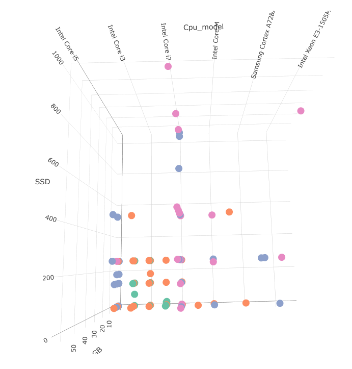

La disposizione dei dati mostra un'andamento lineare rispetto al range dei prezzi (più alte sono le specifiche maggiore sarà la fascia di prezzo), abbiamo quindi utilizzato un kernel *linear* e provato diverse configurazioni del parametro *cost* per ottenere risultati migliori.

**Risultati ottenuti testando il modello con il test set:**

> 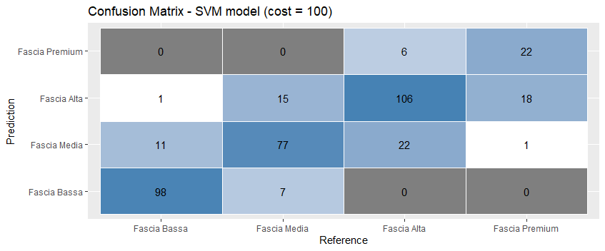
> 
> Accuratezza (*cost* = 1): 78%
> 
> Accuratezza (*cost* = 100): 79%
>  
> **Precision:**
>
> - Fascia bassa: 93%
> - Fascia media: 69%
> - Fascia alta: 76%
> - Fascia premium: 79%
>
>   **Precisione media:** 79% 
>
> **Recall:**
>
> - Fascia bassa: 89%
> - Fascia media: 78%
> - Fascia alta: 79%
> - Fascia premium: 54%
>
>   **Recall media:** 75%
>
> **F-measure:**
> 
> - Fascia bassa: 91%
> - Fascia media: 73%
> - Fascia alta: 77%
> - Fascia premium: 64% 
>
>   **F-measure media:** 76%

---
## **Random forest**

Oltre la scelta di utilizzare un modello basato su albero decisionale abbiamo ritenuto valido provare a generare un modello di tipo Random-forest, basato quindi sulla creazione di un insieme di alberi di decisione (foresta) per effettuare la classificazione.

In particolare, ciascun albero di decisione della foresta viene addestrato con un sottoinsieme casuale dei dati di addestramento, e la classificazione avverrà combinando le previsioni di molti alberi di decisione per migliorare la precisione del modello; ciascun albero nella foresta fornisce infatti una previsione, verrà poi utilizzata la maggioranza delle previsioni per determinare quella effettiva.

Il modello è stato quindi addestrato tramite la funzione *randomForest()* del pacchetto randomForest e testando diverse configurazioni del parametro *ntree*, che determina la quantità di alberi di decisione generata (la grandezza della foresta).

**Risultati ottenuti testando il modello con il test set:**


> 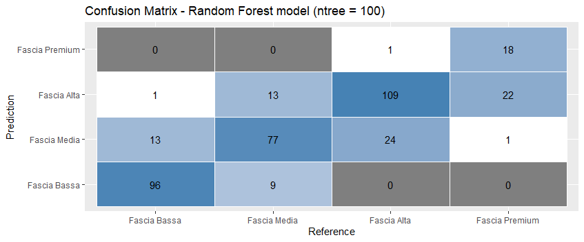
> 
> Accuratezza (*ntree* = 10): 75%
>
> Accuratezza (*ntree* = 100): 78%
>  
> **Precision:**
>
> - Fascia bassa: 91%
> - Fascia media: 67%
> - Fascia alta: 75%
> - Fascia premium: 94%
>
>   **Precisione media:** 82%
> 
> **Recall:**
>  
> - Fascia bassa: 87%
> - Fascia media: 78%
> - Fascia alta: 81%
> - Fascia premium: 41%
>
>   **Recall media:** 72%
>
> **F-measure:**
> 
> - Fascia bassa: 89%
> - Fascia media: 72%
> - Fascia alta: 78%
> - Fascia premium: 58%
>
>   **F-measure media:** 74%


## **Esperimenti:**

Calcolo di ROC e AUC dei modelli di classificazione:

---
## Albero di decisione:

**Curva ROC per classe**

- Fascia bassa:

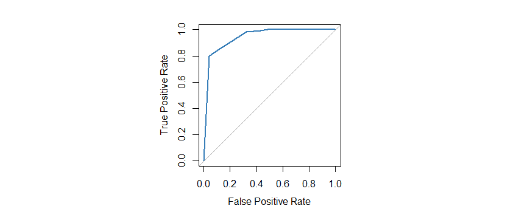

AUC: 0.94

- Fascia media:

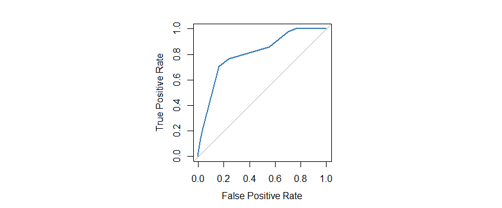

AUC: 0.81

- Fascia alta:

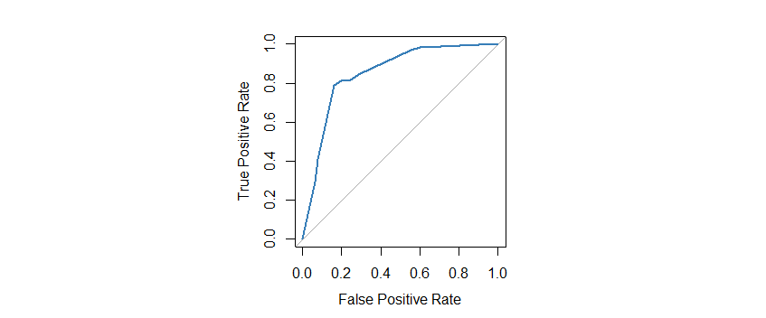

AUC: 0.85

- Fascia premium:

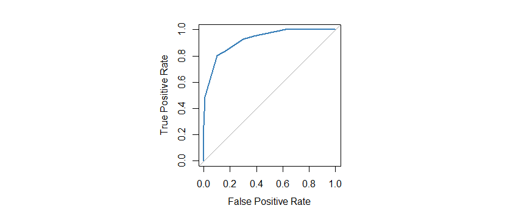

AUC: 0.92

> AUC media: 0.88 


---

## SVM

**Curva ROC per classe**

- Fascia bassa


AUC: 0.95

- Fascia media:

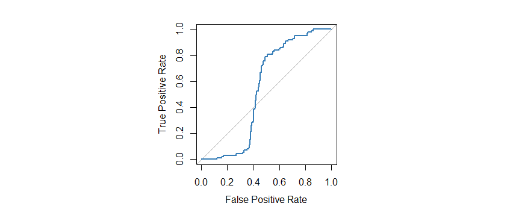

AUC: 0.54

- Fascia alta:

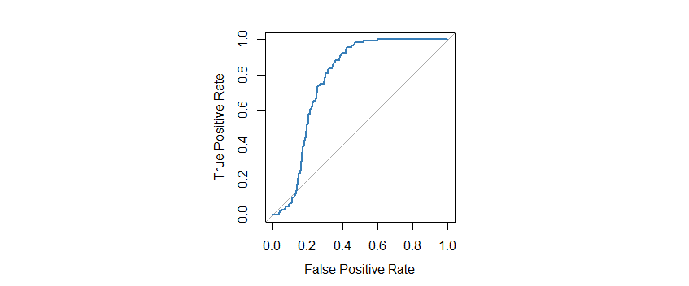

AUC: 0.77

- Fascia premium:

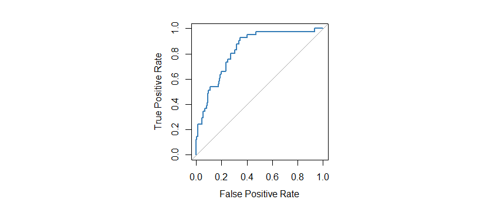

AUC: 0.83

> AUC media: 0.77


---

## Random forest:

Curva ROC per classe:

- Fascia bassa:

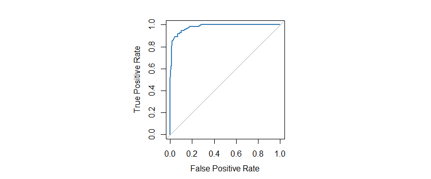

AUC: 0.98

- Fascia media:

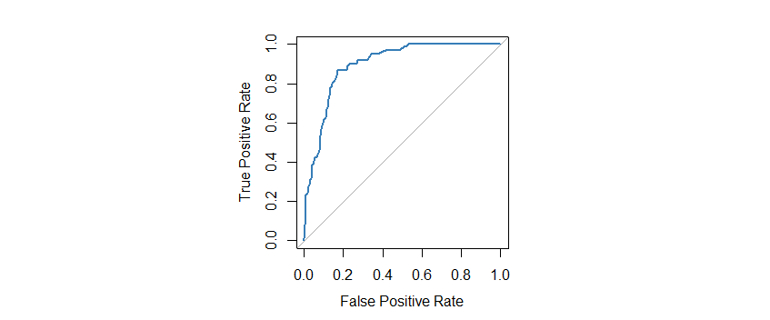

AUC: 0.88

- Fascia alta:

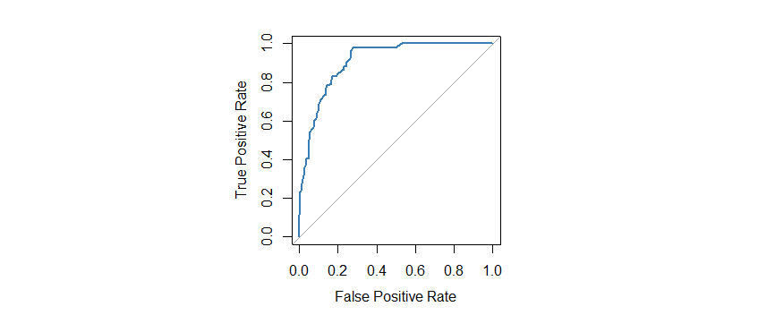

AUC: 0.91

- Fascia premium:

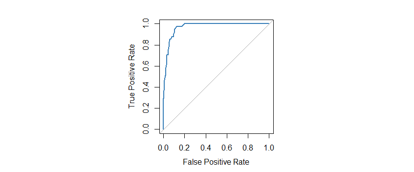

AUC: 0.97

**AUC media: 0.94** 


## **Analisi dei risultati ottenuti e conclusioni:**

- Decision tree:

Per quanto riguarda il modello di classificazione con albero decisione, i risultati dei test effettuati sul test set mostrano una discreta accuratezza nella classificazione, in particolare si dimostra efficace nel riconoscere le istanze positive (precisione media: 77%), producendo tuttavia un quantitativo di FN che provoca un abbassamento di percentuale per la Recall e di conseguenza per l'F-measure (Recall: 70%, F-measure: 72%).

Più nello specifico, il modello trova più difficoltà a riconoscere le istanze appartenenti alla Fascia premium, probabilmente dovuto al fatto che nel set sono presenti meno esempi appartenenti a tale classe.


La validazione eseguita tramite tecnica 10-fold, mostra un abbassamento delle prestazioni di circa il 10%, questo potrebbe significare che il modello potrebbe essere soggetto a overfitting, adattandosi troppo alle caratteristiche del training set e non generalizzando bene con nuove osservazioni incontrate.

- Random forest:

La scelta di addestrare un modello Random forest deriva proprio da questo calo di prestazioni.
In questo caso, oltre ad un generale aumento delle prestazioni con numero di alberi > 50 abbiamo aumento di circa 10% dell'accuratezza tramite 10-fold.

Il modello generalizza quindi bene alle nuove osservazioni e ha imparato bene le relazioni tra le caratteristiche e le etichette, riuscendo a generalizzare queste conoscenze anche a nuovi dati, tuttavia la precisione più bassa su test set potrebbe indicare che il set di addestramento utilizzato contiene un basso numero di esempi.

Anche in questo caso  il modello produce un maggior quantitativo di falsi negativi riguardanti la Fascia premium.


- SVM:

Per quanto riguarda il modello SVM generato abbiamo in generale delle buone prestazioni nella classificazione sia tramite test su test set, che tramite 10-fold; abbiamo infatti valori di accuratezza che discordano di poche percentuali (79% su test set, 76% tramite 10-fold), confermando la buona generalizzazione del modello.

Come negli altri due casi, il modello classifica molti falsi negativi sulla classe Fascia premium, confermando la scarsità di esempi presenti nel dataset


  **Analisi delle curve ROC e AUC:**

Le curve ROC e AUC prodotte mostrano come il modello SVM risulti essere il modello migliore tra quelli sviluppati, presentando un tasso di TPR decisamente maggiore rispetto ai FPR anche rispetto agli altri modelli.

Inoltre le curve ROC di decision tree ed albero di decisione confermano ulteriormente come i modelli facciano fatica a classificare istanze della classe Fascia premium.

